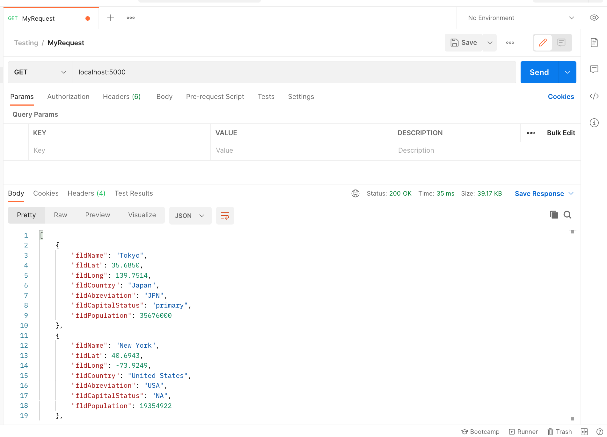
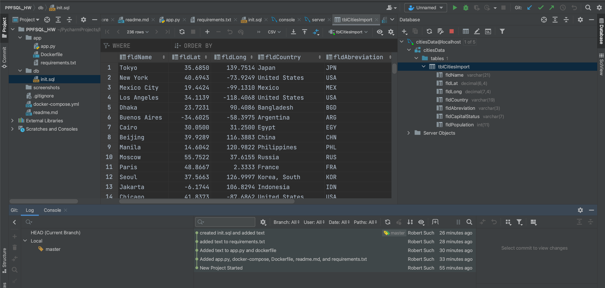

# Project Description
+ This project is to demonstrate a basic Pycharm setup to get started with using Flask and MySQL.
+ Docker is being used to deliver Flask and MySQL from within their own individual containers.
+ Postman is being used to verfiy that requests are being properly handled.

# Screenshot from Postman

# Screenshot from SQL Data

